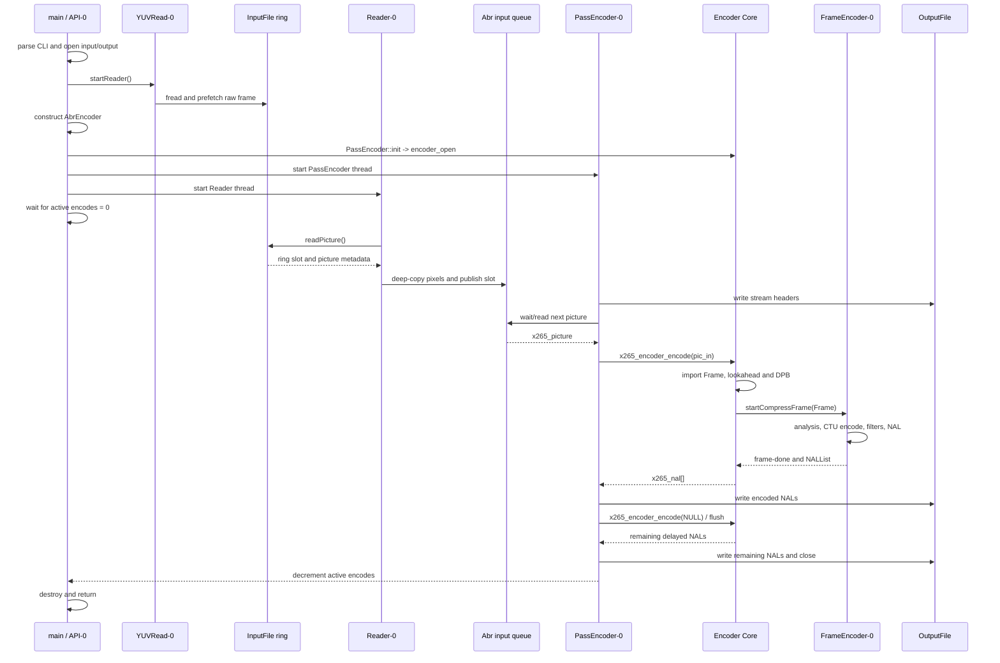

# Master Flow — Tổng quan kiến trúc và execution flow của x265 CLI

Tài liệu này là bản đồ tổng quát để đọc source và log của x265. Nó nối các
phần đã khảo sát: entry point, input reader, ring buffer, `AbrEncoder`,
`PassEncoder`, public API, core `Encoder`, `FrameEncoder`, CTU, NAL và output.

Tài liệu tập trung vào executable `x265` trong repository này. `AbrEncoder`,
`PassEncoder` và `Reader` là tầng ứng dụng CLI; chúng không phải thuật toán
nén HEVC trong core encoder.

## 1. Bức tranh tổng thể

Đường đi cơ bản của một frame:

```text
CLI arguments
    |
    v
main / API-0
    |
    +-- CLIOptions: input, output, x265_param
    |
    v
InputFile reader thread
    |
    v
InputFile ring buffer
    |
    v
Reader-N
    |
    v
AbrEncoder-owned input queue
    |
    v
PassEncoder-N
    |
    | x265_encoder_encode()
    v
x265 core Encoder
    |
    +-- internal Frame + Lookahead + DPB
    |
    v
FrameEncoder-N / worker pool
    |
    +-- CTU analysis
    +-- prediction, transform, quantization
    +-- entropy coding
    +-- filtering
    |
    v
NALList -> x265_nal[]
    |
    v
PassEncoder-N -> OutputFile
    |
    v
.h265 bitstream
```

Quan hệ instance ở tầng cao:

```text
1 process x265
    |
    +-- 1 main thread, được log bằng tên API-0
    |
    +-- 1 AbrEncoder
            |
            +-- N PassEncoder
                    |
                    +-- mỗi PassEncoder có 1 x265 core Encoder
```

Với lệnh encode thông thường, `N = 1`. Với ABR ladder, `N` là số rendition
trong file cấu hình ladder.

## 2. Các lớp có tên gần giống nhau nhưng vai trò khác nhau

| Thành phần | Thuộc tầng | Vai trò |
|---|---|---|
| `main` / `API-0` | process/CLI | parse command, tạo orchestration, chờ hoàn tất, cleanup |
| `AbrEncoder` | CLI orchestration | sở hữu nhóm encode, shared buffer và counter đồng bộ |
| `PassEncoder-N` | CLI orchestration | điều phối một encode/rendition và ghi một output bitstream |
| `x265_encoder` | public API handle | handle C API của một core encoder |
| `Encoder` | encoder core | nhận picture, quản lý lookahead/DPB/rate control và schedule frame |
| `FrameEncoder-N` | encoder core | compress một frame, xử lý CTU và tạo NAL |
| `Worker-N` | encoder core | thực thi các job song song như WPP/PMODE/PME khi cấu hình cho phép |

Hai lưu ý về tên:

1. `PassEncoder` ở đây nên được hiểu là **một encode job/rendition**. Nó
   không mặc định là pass 1 hoặc pass 2 của two-pass rate control.
2. `ABR` trong `AbrEncoder` nói đến **adaptive-bitrate ladder** ở tầng ứng
   dụng. Nó không đồng nghĩa hoàn toàn với chế độ rate control Average Bitrate
   được chọn bằng `--bitrate`.

## 3. Entry point và control flow cấp process

Entry point thật là `main()` tại
[`source/x265.cpp:271`](./source/x265.cpp#L271). `API-0` chỉ là tên logic được
logger gắn cho main thread, không phải một class hoặc function thay thế
`main`.

Flow startup:

```text
main()
  |
  +-- kiểm tra --abr-ladder
  |
  +-- xác định numEncodes
  |     +-- normal CLI: 1
  |     `-- ABR ladder: số dòng encode trong config
  |
  +-- CLIOptions::parse() cho từng encode
  |     +-- tạo x265_param
  |     +-- mở InputFile
  |     +-- mở OutputFile
  |     `-- start InputFile reader
  |
  +-- new AbrEncoder(cliopt, numEncodes)
  |     +-- new PassEncoder-N
  |     +-- PassEncoder-N::init()
  |     |     `-- x265_encoder_open()
  |     +-- cấp phát input/analysis queues
  |     `-- start PassEncoder, Reader hoặc Scaler
  |
  +-- chờ m_numActiveEncodes về 0
  |
  +-- destroy AbrEncoder và CLI resources
  `-- return
```

`main` luôn tạo một `AbrEncoder` tại
[`source/x265.cpp:350`](./source/x265.cpp#L350), kể cả khi không bật
`--abr-ladder`. Vì vậy single encode vẫn có topology:

```text
AbrEncoder
    `-- PassEncoder-0
            `-- x265 Encoder instance 0
```

## 4. Input: từ file tới queue của một encode

### 4.1 InputFile reader

Với raw YUV, `CLIOptions::parse()` mở một `YUVInput` rồi gọi
`startReader()` tại [`source/x265cli.cpp:1038`](./source/x265cli.cpp#L1038).
`YUVInput` có thread riêng:

```text
YUVRead-N
    |
    +-- fread() một raw frame
    `-- publish buffer slot bằng writeCount
```

Y4M dùng cùng ý tưởng nhưng worker có tên `Y4MRead-N`.

Ring của `YUVInput` có năm slot (`QUEUE_SIZE = 5`) tại
[`source/input/yuv.h:31`](./source/input/yuv.h#L31). Điều kiện full trong
[`source/input/yuv.cpp:187`](./source/input/yuv.cpp#L187) giới hạn tối đa bốn
frame chưa được consumer lấy. Trong một lần chạy, reader có thể đọc tổng cộng
hơn bốn frame nếu consumer đồng thời giải phóng slot; con số bốn là số frame
outstanding tối đa, không phải tổng số lần `fread`.

### 4.2 Vì sao `startReader()` nằm trong vòng `for view`

`CLIOptions::input` là một mảng `InputFile*`, vì multiview có thể có một file
vật lý cho mỗi view. Số input reader được start là:

```cpp
param->numViews - !!param->format
```

| Cấu hình | Input vật lý | Reader được start |
|---|---:|---:|
| single-view, normal | 1 | 1 |
| hai view, hai file riêng | 2 | 2 |
| hai view side-by-side trong một file | 1 | 1 |
| hai view over-under trong một file | 1 | 1 |

`!!format` biến mọi packed format khác 0 thành 1. Với side-by-side hoặc
over-under, core encoder nhận một picture vật lý rồi chọn nửa tương ứng cho
từng view trong [`source/common/picyuv.cpp:341`](./source/common/picyuv.cpp#L341).

Vòng `for` này lặp theo **nguồn input vật lý**, không lặp theo frame và không
tạo một reader cho mỗi frame.

### 4.3 Hai tầng reader

Tên `YUVRead` và `Reader` biểu diễn hai boundary khác nhau:

```text
                    buffer thuộc InputFile
YUV file -> YUVRead ------------------------> Reader-N
               fread + prefetch                readPicture
                                                     |
                                                     | deep-copy pixels
                                                     v
                                      AbrEncoder::m_inputPicBuffer[N]
```

- `YUVRead-N` thực hiện file I/O và prefetch.
- `YUVInput::readPicture()` trao con trỏ slot của ring cho consumer.
- `Reader-N` deep-copy pixel vào queue do `AbrEncoder` sở hữu.
- `PassEncoder-N::readPicture()` lấy metadata và plane pointers của picture
  trong queue; nó không copy toàn bộ plane thêm lần nữa tại boundary này.

`Reader::threadMain()` nằm tại
[`source/abrEncApp.cpp:1393`](./source/abrEncApp.cpp#L1393).

## 5. `AbrEncoder`: owner của orchestration, không phải dispatcher thread

`AbrEncoder` được khai báo tại
[`source/abrEncApp.h:41`](./source/abrEncApp.h#L41). Nó sở hữu:

- `m_passEnc[]`: các encode/rendition;
- `m_inputPicBuffer[]`: queue picture của từng encode;
- `m_analysisBuffer[]`: queue analysis để các rendition reuse;
- các atomic counter read/write dùng để chờ và đánh thức;
- số encode còn hoạt động.

Nó **không có `threadMain()`**, vì vậy không tồn tại một bước runtime như:

```text
Reader -> AbrEncoder thread -> dispatch -> PassEncoder
```

Flow thật là:

```text
Reader-N
   |
   | ghi trực tiếp
   v
AbrEncoder::m_inputPicBuffer[N]
   |
   | PassEncoder-N tự consume
   v
PassEncoder-N
```

`AbrEncoder` là owner của storage và synchronization context. Producer và
consumer tự giao tiếp qua buffer/counter đó.

Queue depth được chọn trong constructor tại
[`source/abrEncApp.cpp:84`](./source/abrEncApp.cpp#L84):

```text
single encode: queue size = 1
ABR ladder:    queue size = 250
```

## 6. `PassEncoder`: một output/rendition

`PassEncoder` là một `Thread`, được khai báo tại
[`source/abrEncApp.h:70`](./source/abrEncApp.h#L70). Mỗi instance có riêng:

- `x265_param*`;
- `x265_encoder*`;
- input/output config;
- output file và optional recon output;
- một `Reader` hoặc `Scaler`;
- vòng lặp submit/flush;
- trạng thái và return code.

`PassEncoder::init()` mở core encoder tại
[`source/abrEncApp.cpp:283`](./source/abrEncApp.cpp#L283). Sau đó
`PassEncoder::threadMain()` tại
[`source/abrEncApp.cpp:672`](./source/abrEncApp.cpp#L672) thực hiện:

```text
write VPS/SPS/PPS headers
        |
        v
while input còn frame
    |
    +-- readPicture() từ AbrEncoder input queue
    +-- gắn POC/PTS và metadata
    +-- x265_encoder_encode(pic_in)
    +-- nhận x265_nal[] nếu có output
    `-- ghi NAL ra OutputFile
        |
        v
x265_encoder_encode(NULL) để flush delayed frames
        |
        v
đóng encoder/output và báo encode hoàn tất
```

Một `PassEncoder` sở hữu đúng một `x265_encoder` core. Quan hệ cardinality:

```text
1 AbrEncoder ---- N PassEncoder
1 PassEncoder --- 1 x265 core Encoder
```

## 7. Normal encode và ABR ladder

### 7.1 Normal encode

```text
File-0
  `-- YUVRead-0
        `-- Input ring-0
              `-- Reader-0
                    `-- inputPicBuffer[0]
                          `-- PassEncoder-0
                                `-- x265 Encoder-0
```

### 7.2 ABR ladder với input riêng cho từng rendition

Mỗi dòng trong ABR config tạo một `CLIOptions` và một `PassEncoder`:

```text
File-0 -> YUVRead-0 -> ring-0 -> Reader-0 -> buffer-0 -> PassEncoder-0
File-1 -> YUVRead-1 -> ring-1 -> Reader-1 -> buffer-1 -> PassEncoder-1
File-2 -> YUVRead-2 -> ring-2 -> Reader-2 -> buffer-2 -> PassEncoder-2
                                           ^
                                           |
                              AbrEncoder owns buffers/counters
```

Do đó không nên suy ra rằng ABR ladder luôn chỉ có một `YUVRead`. Thông
thường mỗi `InputFile` vật lý đã mở có một input reader riêng.

### 7.3 Nhánh dùng Scaler

Khi một pass sau bật nhánh scaler, pass đó không tạo `Reader`; `Scaler-N` lấy
picture từ queue của pass trước, scale và publish vào queue của pass hiện tại:

```text
Reader-0 -> buffer-0 -> PassEncoder-0
                |
                `-- Scaler-1 -> buffer-1 -> PassEncoder-1
                                      |
                                      `-- Scaler-2 -> buffer-2 -> PassEncoder-2
```

Flow scaler nằm trong
[`source/abrEncApp.cpp:1279`](./source/abrEncApp.cpp#L1279).

### 7.4 Analysis reuse giữa các rendition

ABR config có dạng:

```text
[encID:reuse-level:refID] <CLI arguments>
```

Pass tham chiếu publish analysis; pass phụ thuộc chờ đúng analysis rồi reuse:

```text
PassEncoder-0: 540p
      |
      | save analysis
      v
AbrEncoder::m_analysisBuffer[0]
      |
      | load/reuse analysis
      v
PassEncoder-1: 1080p
      |
      | save analysis
      v
AbrEncoder::m_analysisBuffer[1]
      |
      v
PassEncoder-2: 2160p
```

Các pass có thread riêng và có thể overlap theo frame. Consumer chỉ block khi
input picture hoặc analysis cần thiết chưa sẵn sàng; không bắt buộc encode
xong toàn bộ rendition trước rồi mới chạy rendition kế tiếp.

## 8. Public API boundary và core encoder

`PassEncoder` gọi public C API; API chuyển tiếp vào C++ core:

```text
PassEncoder::threadMain
    |
    +-- x265_encoder_open(param)
    |       `-- tạo và cấu hình Encoder
    |
    +-- x265_encoder_headers()
    |       `-- trả VPS/SPS/PPS và optional SEI
    |
    +-- x265_encoder_encode(pic_in)
    |       `-- Encoder::encode(pic_in)
    |
    +-- x265_encoder_encode(NULL)
    |       `-- flush delayed pictures
    |
    `-- x265_encoder_close()
```

API implementation nằm ở
[`source/encoder/api.cpp:75`](./source/encoder/api.cpp#L75) và
[`source/encoder/api.cpp:422`](./source/encoder/api.cpp#L422).
Core flow bắt đầu ở
[`source/encoder/encoder.cpp:1486`](./source/encoder/encoder.cpp#L1486).

Trong `Encoder::encode()`:

1. Validate/import `x265_picture`.
2. Lấy hoặc tạo internal `Frame`.
3. Copy picture vào internal picture storage.
4. Đưa frame vào Lookahead để quyết định slice type/order.
5. DPB chuẩn bị reference pictures và RPS.
6. Chọn một `FrameEncoder` rảnh.
7. Handoff frame bằng `startCompressFrame()`.
8. Collect frame đã hoàn tất và lấy NAL khi output sẵn sàng.

Lookahead có thể làm output trễ so với input. Vì vậy một call
`x265_encoder_encode(pic_in)` có thể trả `0` NAL; các call tiếp theo hoặc flush
mới trả frame đã encode. Với tune zero-latency và cấu hình đơn giản, input
frame có thể được trả ngay trong cùng call.

## 9. Core frame flow: từ `Frame` tới CTU và NAL

```text
Encoder::encode
    |
    +-- Lookahead::addPicture
    +-- Lookahead::getDecidedPicture
    +-- DPB::prepareEncode
    |
    v
FrameEncoder::startCompressFrame
    |
    | trigger frame-start event
    v
FrameEncoder::threadMain
    |
    v
FrameEncoder::compressFrame
    |
    +-- rate-control/frame setup
    +-- slice header setup
    +-- process CTU rows
    |     |
    |     +-- Analysis::compressCTU
    |     |     `-- chọn split/mode/MV/transform/quant decisions
    |     |
    |     `-- Entropy::encodeCTU
    |           `-- viết syntax bằng CABAC
    |
    +-- deblock/SAO và các filter được bật
    +-- serialize slice/substreams
    +-- tạo VPS/SPS/PPS/SEI/slice NAL theo cấu hình
    |
    | trigger frame-done event
    v
FrameEncoder::getEncodedPicture
    |
    v
NALList ownership transfer về Encoder
```

Các điểm vào quan trọng:

| Stage | Source |
|---|---|
| schedule frame | [`FrameEncoder::startCompressFrame`](./source/encoder/frameencoder.cpp#L277) |
| frame worker loop | [`FrameEncoder::threadMain`](./source/encoder/frameencoder.cpp#L302) |
| compress frame | [`FrameEncoder::compressFrame`](./source/encoder/frameencoder.cpp#L473) |
| CTU row | [`FrameEncoder::processRowEncoder`](./source/encoder/frameencoder.cpp#L1559) |
| mode analysis | [`Analysis::compressCTU`](./source/encoder/analysis.cpp#L308) |
| CABAC syntax | [`Entropy::encodeCTU`](./source/encoder/entropy.cpp#L1161) |
| collect encoded frame | [`FrameEncoder::getEncodedPicture`](./source/encoder/frameencoder.cpp#L2638) |
| serialize NAL | [`NALList::serialize`](./source/encoder/nal.cpp#L67) |

## 10. Thread topology phụ thuộc cấu hình

Không có một số lượng thread cố định cho mọi lần chạy.

### Luôn hoặc thường thấy ở CLI flow

- main thread, log là `API-0`;
- một input thread cho mỗi `InputFile` vật lý (`YUVRead`/`Y4MRead`);
- một `PassEncoder` thread cho mỗi encode/rendition;
- một `Reader` hoặc `Scaler` cấp input cho mỗi pass;
- một hoặc nhiều `FrameEncoder` cho mỗi core encoder.

### Có thể xuất hiện tùy option

- worker pool threads;
- WPP row jobs;
- PMODE/PME jobs;
- lookahead-related work;
- nhiều frame encoder do frame parallelism;
- nhiều view/layer.

Với profile debug một frame hiện tại:

```text
--frame-threads 1 --pools none --no-wpp
--tune zerolatency --frames 1
```

topology quan sát được là:

```text
API-0
YUVRead-0
Reader-0
PassEncoder-0
FrameEncoder-0
```

Không có `Worker-N`; `FrameEncoder-0` tự xử lý tuần tự các CTU. Đây là topology
cố ý đơn giản hóa để học flow, không phải topology mặc định cho production.

## 11. Sequence diagram end-to-end cho single encode

`API-0` là main thread. `Encoder Core` và `Queues` là logical component, không
nhất thiết là OS thread độc lập.



## 12. Các channel và ownership

| Channel/boundary | Producer | Consumer | Payload | Storage owner |
|---|---|---|---|---|
| `yuv-ring` | `YUVRead-N` | `Reader-N` | raw planar frame | `YUVInput` |
| `input-pic-buffer[N]` | `Reader-N`/`Scaler-N` | `PassEncoder-N` | copied pixels + picture metadata | `AbrEncoder` |
| `analysisBuffer[N]` | reference `PassEncoder` | dependent `PassEncoder` | reusable analysis decisions | `AbrEncoder` |
| lookahead input | `Encoder` | Lookahead logic | internal `Frame` | encoder core |
| `frame-start` | `Encoder` | `FrameEncoder` | internal `Frame*` | encoder core |
| `frame-done` | `FrameEncoder` | `Encoder` | completion + NAL list | encoder core |
| raw output | `PassEncoder` | `OutputFile` | `x265_nal[]` bytes | API/core until next encode call |

Trong log, `owner_before/owner_after` thường mô tả **quyền xử lý tiếp theo**,
không mặc định là quyền `free()` memory. Ví dụ `Reader` nhận một YUV ring slot
nhưng memory vẫn thuộc `YUVInput`.

Một trường hợp ownership memory thật sự được chuyển là
`NALList::takeContents()` tại
[`source/encoder/nal.cpp:43`](./source/encoder/nal.cpp#L43): output list lấy
buffer từ list của `FrameEncoder`.

Các channel trên đều là giao tiếp giữa thread trong cùng process bằng memory,
atomic counter và event. Đây không phải IPC giữa nhiều process.

## 13. Object transformation qua các boundary

```text
bytes trong file
    |
    | fread
    v
YUVInput::buf[ring slot]
    |
    | YUVInput::readPicture: wrap bằng x265_picture
    v
temporary x265_picture của Reader
    |
    | memcpy pixels
    v
AbrEncoder::m_inputPicBuffer[pass][slot]
    |
    | PassEncoder::readPicture: nhận metadata/pointers
    v
PassEncoder pic_in
    |
    | x265_encoder_encode
    v
core Frame + PicYuv + EncoderData
    |
    | analysis / transform / quant / CABAC
    v
Bitstream + NALList
    |
    | public API exposes x265_nal[]
    v
OutputFile writes Annex-B bytes
```

Không nên chỉ theo tên biến `pic`; nên theo cả:

- POC/PTS;
- queue index;
- `x265_picture*` address;
- `planes[0]` address;
- internal `Frame*` address;
- thread và event ID.

Các địa chỉ chỉ có ý nghĩa trong một lần chạy.

## 14. Cách đọc log theo phase

Khi đọc `x265.log` hoặc [`step1_1.4.log`](./step1_1.4.log), chia timeline thành
các phase sau:

```text
PHASE 0  process entry và CLI parse
PHASE 1  InputFile reader start/prefetch
PHASE 2  AbrEncoder/PassEncoder/core Encoder initialization
PHASE 3  Reader publish picture vào Abr input queue
PHASE 4  PassEncoder submit picture qua public API
PHASE 5  Encoder import Frame, lookahead và DPB
PHASE 6  FrameEncoder xử lý CTU và tạo NAL
PHASE 7  Encoder trả x265_nal[] cho PassEncoder
PHASE 8  OutputFile ghi bitstream
PHASE 9  flush, worker stop và cleanup
```

Thứ tự nên lần theo:

1. `event` để có total order xuyên thread;
2. `thread` để biết ai đang thực thi;
3. `channel` và queue slot để nối producer/consumer;
4. frame/POC và object address để giữ identity;
5. `owner_before/owner_after` để biết component xử lý tiếp theo.

## 15. Source navigation map

| Câu hỏi | Bắt đầu đọc tại |
|---|---|
| Process bắt đầu ở đâu? | [`main`](./source/x265.cpp#L271) |
| CLI mở/start input ở đâu? | [`CLIOptions::parse`](./source/x265cli.cpp#L645), [`startReader`](./source/x265cli.cpp#L1038) |
| Raw YUV được prefetch ra sao? | [`YUVInput::threadMain`](./source/input/yuv.cpp#L163) |
| Ring slot được đưa ra sao? | [`YUVInput::readPicture`](./source/input/yuv.cpp#L216) |
| Ai tạo các encode job? | [`AbrEncoder::AbrEncoder`](./source/abrEncApp.cpp#L79) |
| Ai copy input vào shared queue? | [`Reader::threadMain`](./source/abrEncApp.cpp#L1393) |
| Vòng encode CLI nằm ở đâu? | [`PassEncoder::threadMain`](./source/abrEncApp.cpp#L672) |
| Public encode API ở đâu? | [`x265_encoder_encode`](./source/encoder/api.cpp#L422) |
| Core nhận picture ở đâu? | [`Encoder::encode`](./source/encoder/encoder.cpp#L1486) |
| Frame worker bắt đầu ở đâu? | [`FrameEncoder::threadMain`](./source/encoder/frameencoder.cpp#L302) |
| CTU được phân tích ở đâu? | [`Analysis::compressCTU`](./source/encoder/analysis.cpp#L308) |
| CTU syntax được encode ở đâu? | [`Entropy::encodeCTU`](./source/encoder/entropy.cpp#L1161) |
| NAL được serialize ở đâu? | [`NALList::serialize`](./source/encoder/nal.cpp#L67) |
| Bytes được ghi ra file ở đâu? | [`RAWOutput::writeFrame`](./source/output/raw.cpp#L80) |

## 16. Mô hình cần ghi nhớ

```text
InputFile reader = file I/O + prefetch
Reader           = copy vào queue của một encode
AbrEncoder       = owner/orchestrator của N encode và shared state
PassEncoder      = một encode job/rendition + output loop
Encoder          = core scheduling/lookahead/DPB/rate control
FrameEncoder     = compress một frame thành NAL
Worker pool      = parallel execution bên trong core khi được bật
```

Với capture một frame hiện tại, rút gọn thành:

```text
main/API-0
  starts and waits
       |
YUV file -> YUVRead-0 -> ring -> Reader-0 -> Abr queue
                                                |
                                                v
                                         PassEncoder-0
                                                |
                                                v
                                           Encoder core
                                                |
                                                v
                                          FrameEncoder-0
                                                |
                                                v
                                           NAL -> .h265
```

Đây là skeleton để đặt mọi breakpoint và mọi event log vào đúng tầng trước
khi đi sâu vào thuật toán cụ thể.
