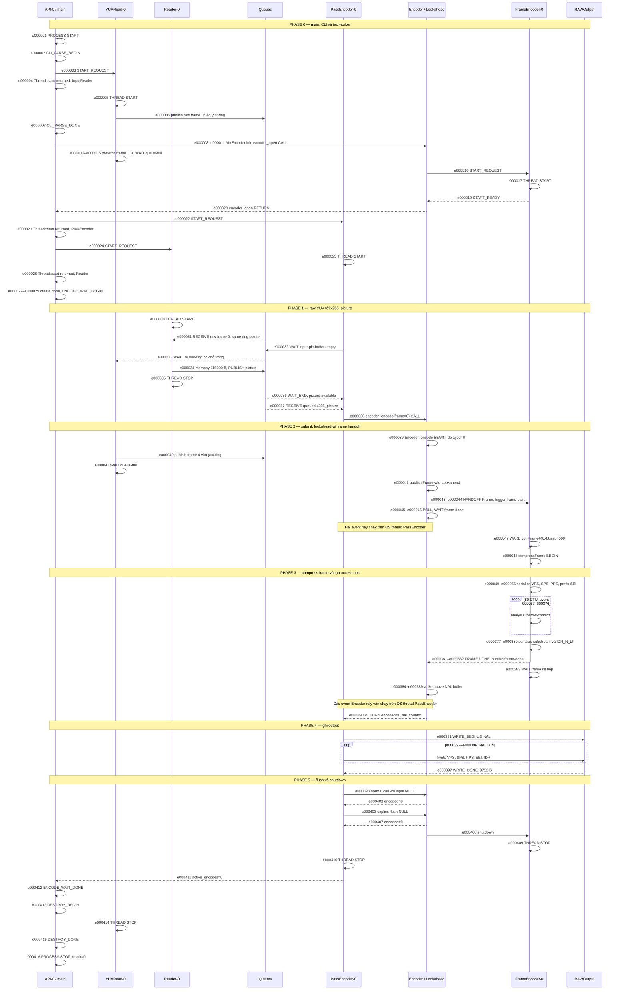
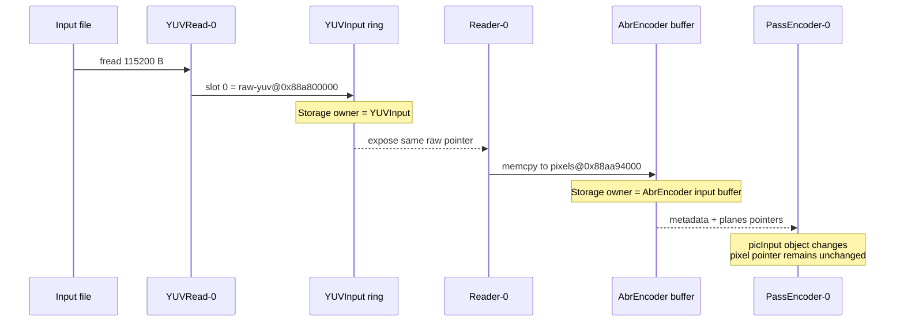
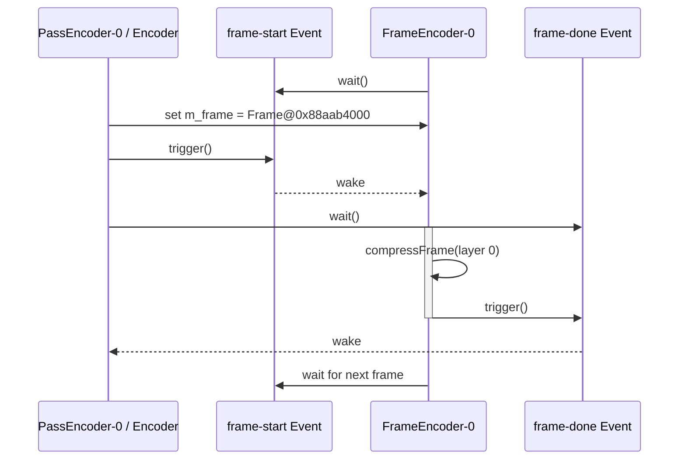
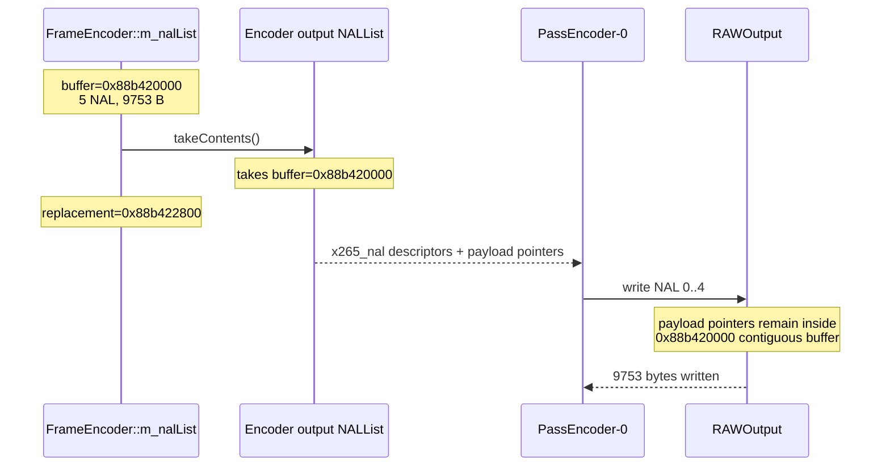

# Step 1.4 — Flow encode một frame trong x265

Tài liệu này giải thích execution trace trong
[`step1_1.4.log`](./step1_1.4.log). Đây là một lần encode frame 0 với profile
`x265: 1 frame (simple flow)`: input 320x240, 8-bit I420, preset
`ultrafast`, tune `zerolatency`, một frame thread, `--pools none`,
`--no-wpp` và `--no-asm`.

Mục tiêu không chỉ là liệt kê function call. Ta cần thấy:

- thread nào thực thi mỗi bước;
- dữ liệu được copy hay chỉ truyền con trỏ;
- thread giao việc và đánh thức nhau qua channel/event nào;
- “owner” ở mỗi giai đoạn có nghĩa gì;
- một `Frame` trở thành CTU decisions, NAL units và cuối cùng là byte trong
  file như thế nào.

## 1. Kết luận nhanh

Flow thực tế của frame 0 là:

```text
main / API-0
  -> parse CLI và yêu cầu khởi động input reader
  -> tạo AbrEncoder / PassEncoder
  -> encoder_open và yêu cầu khởi động FrameEncoder-0
  -> yêu cầu khởi động PassEncoder-0 và Reader-0
  -> chờ active_encodes về 0

file YUV
  -> YUVRead-0
  -> YUVInput ring slot
  -> Reader-0 (copy 115200 byte)
  -> AbrEncoder input-picture slot
  -> PassEncoder-0 / x265_picture
  -> Encoder::encode
  -> Lookahead (logic, không thấy thread riêng trong trace này)
  -> FrameEncoder-0
  -> 80 CTU theo thứ tự 0..79
  -> 5 Annex-B NAL
  -> NAL buffer transfer về Encoder
  -> PassEncoder-0
  -> RAWOutput
  -> step1_output_1f.h265 (9753 byte)
```

Các điểm nổi bật:

1. Có năm OS thread xuất hiện trong log: thread chính `API-0` cùng bốn
   worker `YUVRead-0`, `Reader-0`, `PassEncoder-0` và
   `FrameEncoder-0`.
2. Không có `Worker-N`, vì `FrameEncoder-0` khởi động với `pool=0x0`.
   Với `--pools none --no-wpp`, chính frame thread xử lý tuần tự toàn bộ CTU.
3. Đây không phải IPC giữa nhiều process. Các `CHANNEL` là giao tiếp
   inter-thread trong cùng process bằng ring buffer, atomic counter và event.
4. Input chỉ encode một frame nhưng `YUVRead-0` đã prefetch năm raw frame.
   `Reader-0` chỉ lấy frame 0; các frame còn lại nằm trong ring cho đến lúc
   shutdown.
5. Input call `encoder_encode(picInput)` trả frame ngay trong cùng call:
   `encoded=1`, `delayed=0`. Đây là hành vi zero-latency quan sát được.
6. Frame 320x240 dùng CTU 32x32, tạo grid `ceil(320/32) x ceil(240/32) =
   10 x 8 = 80 CTU`.
7. Tất cả CTU có `pred_mode=2`, tức `MODE_INTRA`, phù hợp với frame IDR
   duy nhất của profile `keyint=1`.
8. Năm NAL được ghi: VPS, SPS, PPS, prefix SEI và IDR_N_LP. Tổng số byte
   thật ghi ra file là 9753.
9. `event=000001..000416` là thứ tự toàn cục liên tục. Dùng `event`
   để lần flow giữa thread; dùng timestamp để xem khoảng thời gian.

## 2. Cách đọc một dòng log

Ví dụ:

```text
[event=000046]
2026-09-24 10:00:20.191549
[thread=PassEncoder id=6173618176]
frameencoder.cpp:2645
[CHANNEL channel=frame-done encoder=0 frame=0]
WAIT_BEGIN reason=frame-in-progress
object=Frame@0x88aab4000 owner=Encoder
```

Ý nghĩa:

| Trường | Ý nghĩa |
|---|---|
| `event` | Số thứ tự tăng toàn cục dưới cùng một logger lock |
| timestamp | Thời điểm event được ghi, độ phân giải microsecond |
| `thread` | Tên logic gắn tại điểm trace |
| `id` | ID OS thread trong lần chạy này |
| `file:line` | Vị trí instrumentation trong source đã build |
| nhóm event | `THREAD`, `CHANNEL`, `CTU`, `BITSTREAM`, v.v. |
| object/pointer | Identity của object trong đúng lần chạy này |
| owner | Component/thread đang chịu trách nhiệm cho bước xử lý |

Pointer và thread ID chỉ có ý nghĩa trong một process/lần chạy. Không so sánh
địa chỉ giữa hai lần encode.

`event` là cột nên đọc đầu tiên. Timestamp giữa các thread có thể rất gần
nhau, còn event ID cho một total order rõ ràng theo thứ tự logger nhận event.

### “Owner” không phải lúc nào cũng là memory owner

Trong phần lớn log, `owner_before/owner_after` mô tả **execution ownership**:
component nào đang được quyền xử lý object tiếp theo. Nó không ngụ ý component
đó được phép `free()` vùng nhớ.

Ví dụ, khi ring buffer ghi `owner_after=Reader`, storage vẫn do
`YUVInput` quản lý; `Reader` chỉ trở thành consumer hợp lệ của slot.

Ngoại lệ quan trọng là `NALList::takeContents`: ở đó pointer buffer thật sự
được chuyển từ `FrameEncoder::m_nalList` sang output `NALList`. Log
`TRANSFER_BEGIN/TRANSFER_DONE` phản ánh memory ownership thật.

## 3. Thread topology

| Logical worker | Raw `thread=` tag | OS thread ID | Vai trò | Số dòng |
|---|---|---:|---|---:|
| `API-0` | `API-0` | 8665295936 | chạy `main`, parse CLI, tạo worker, chờ và cleanup | 25 |
| `YUVRead-0` | `YUVRead-0` | 6172471296 | đọc/prefetch raw YUV vào ring | 10 |
| `Reader-0` | `Reader` | 6174191616 | copy raw picture sang AbrEncoder input queue | 4 |
| `PassEncoder-0` | `PassEncoder` | 6173618176 | điều phối encode API và ghi output | 36 |
| `FrameEncoder-0` | `FrameEncoder` | 6173044736 | compress frame, analysis/entropy CTU, tạo NAL | 341 |

`API-0` chính là thread chạy `main()` tại
[`source/x265.cpp:271`](./source/x265.cpp). Event 1 là process entry đã vào
phần instrumentation; event 416 là process stop ngay trước `return ret`.
`Lookahead` xuất hiện như một component logic nhưng không có thread riêng
trong trace này. Với `lookaheadDepth=0`, không nên tự suy ra rằng mọi
`Lookahead` đều luôn có một worker riêng.

`InputReader-0` trong event `THREAD-CONTROL` là tên control-plane dùng
trước khi biết worker implementation nào đang chạy. Với input `.yuv` của
capture này, worker tương ứng là `YUVRead-0`; input Y4M sẽ dùng
`Y4MRead-0`.

Các event `THREAD-CONTROL` phải được phân biệt:

- `START_REQUEST`: `API-0` sắp gọi `Thread::start()`;
- `START_RETURN`: lời gọi tạo thread đã return, worker có thể đã hoặc chưa
  chạy `threadMain()`;
- `START_READY`: riêng `FrameEncoder-0`, API đã chờ tín hiệu init xong;
- `[THREAD ...] START`: event do chính worker ghi sau khi vào
  `threadMain()`.

`FrameEncoder-0` báo:

```text
[THREAD worker=FrameEncoder-0 role=frame-worker] START pool=0x0
```

`pool=0x0` xác nhận không có general worker pool. Vì vậy việc log không có
`Worker-0`, `Worker-1`, ... là đúng với cấu hình, không phải mất event.

## 4. Các channel và cơ chế đồng bộ

| Channel | Producer | Consumer | Payload/ý nghĩa | Cơ chế quan sát được |
|---|---|---|---|---|
| `yuv-ring` | `YUVRead-0` | `Reader-0` | raw planar YUV slot | read/write counters, wait khi full/empty |
| `input-pic-buffer` | `Reader-0` | `PassEncoder-0` | copied pixel buffer + `x265_picture` metadata | picture counters và queue slot |
| `lookahead-input` | `Encoder` | `Lookahead` | internal `Frame` | logical queue/handoff |
| `frame-start` | `Encoder` | `FrameEncoder-0` | `Frame@0x88aab4000` | `m_enable.trigger()/wait()` |
| `frame-done` | `FrameEncoder-0` | `Encoder` | completed frame + NAL list | `m_done.trigger()/wait()` |
| `nal-output` | `FrameEncoder` | `Encoder` | access-unit buffer | real buffer ownership transfer |
| raw output | `PassEncoder-0` | output file | five NAL payloads | synchronous `fwrite()` |

Không có socket, pipe, shared memory giữa process hoặc message broker. “IPC”
trong cách đọc log này nên hiểu là **inter-thread communication**.

## 5. Sequence diagram end-to-end

Các participant được giữ nguyên từ event 1 tới event 416. Các dòng
`PHASE` chỉ đánh dấu chặng mới; lifeline và thứ tự thời gian vẫn chạy liên
tục từ trên xuống dưới. `API`, `YUV`, `Reader`, `PassEncoder` và
`FrameEncoder` là thread/worker lane; `Encoder / Lookahead`, `Queues`
và `RAWOutput` là logical component lane. Vì vậy event trên lane
`Encoder` vẫn có thể được thực thi bởi OS thread `PassEncoder`, đúng theo
`thread=` trong raw log.

### Bảng phạm vi event để đối chiếu log

Các phase có thể xen kẽ vì nhiều thread chạy đồng thời. Bảng này dùng phạm vi
event của **đường đi chính**; cột ghi chú chỉ rõ các event chen ngang hoặc
phạm vi không liên tục.

| Phase | Event chính | Nội dung | Ghi chú |
|---|---:|---|---|
| 0 — startup | 1–29 | `main`, CLI, input prefetch, tạo encoder/worker | YUV prefetch ở 5–6 và 12–15 xen với init |
| 1 — input handoff | 30–38 | ring → `Reader` → Abr buffer → API call | YUV wake/prefetch chen ở 33 và 40–41 |
| 2 — submit/schedule | 39–48 | tạo `Frame`, qua Lookahead, giao `FrameEncoder` | API call chưa return; nó kéo dài đến 390 |
| 3a — header NAL | 49–56 | serialize VPS, SPS, PPS và prefix SEI | xảy ra trước CTU 0 |
| 3b — CTU | 57–376 | 80 CTU × 4 event | analysis + row-context |
| 3c — slice NAL | 377–380 | serialize CTU substream và IDR slice | access unit đạt 9753 byte |
| 3d — complete/return | 381–390 | frame-done, chuyển NAL ownership, API return | thread thực thi đổi từ FrameEncoder sang PassEncoder |
| 4 — output | 391–397 | ghi năm NAL xuống file | tổng 9753 byte |
| 5 — shutdown | 398–416 | hai flush call, dừng worker, destroy | cả hai flush trả `encoded=0` |



## 6. Phase A — Input prefetch và ring buffer (events 5–41)

Phạm vi này không liên tục hoàn toàn: input prefetch chạy song song với
startup ở events 5–15, `Reader` consume ở 30–35, rồi `YUVRead` prefetch thêm
ở 33 và 40–41.

### 6.1 Frame 0 được đọc vào ring (events 5–15, 31, 33, 40–41)

Events 5–15 cho thấy `YUVRead-0` chạy và prefetch trước khi `Reader-0`
bắt đầu ở event 30:

- frame 0: slot 0, `raw-yuv@0x88a800000`;
- frame 1: slot 1;
- frame 2: slot 2;
- frame 3: slot 3;
- sau đó producer chờ vì queue full.

Mỗi frame là 115200 byte:

```text
320 * 240                           = 76800 luma bytes
(320 / 2) * (240 / 2) * 2 planes   = 38400 chroma bytes
total                               = 115200 bytes
```

Ring có `QUEUE_SIZE=5` nhưng chỉ cho tối đa bốn unread frame để phân biệt
trạng thái full và empty. Vì vậy producer chờ tại `write_count=4,
read_count=0`.

Khi `Reader-0` nhận frame 0 ở event 31, `read_count` thay đổi.
`YUVRead-0` ghi `WAIT_END` ở event 33, đọc thêm frame 4 ở event 40 rồi
lại chờ.

Đây là lý do `--frames 1` vẫn có năm lần `fread`: giới hạn encode được áp
dụng ở consumer, còn input thread được phép prefetch độc lập.

### 6.2 Reader thực hiện deep copy (events 30–35)

Hai pointer quan trọng:

```text
YUVInput ring source: 0x88a800000
AbrEncoder destination pixels: 0x88aa94000
```

Địa chỉ khác nhau và event ghi `bytes=115200`. Kết hợp với
`memcpy(dest->planes[0], src->planes[0], src->framesize)` trong
[`source/abrEncApp.cpp`](./source/abrEncApp.cpp), ta xác nhận đây là deep
copy pixel data.

Sau copy, queue object là `x265-picture@0x88ac98000`. `Reader-0` publish
slot 0 rồi dừng vì chỉ cần một input frame.

### 6.3 PassEncoder chỉ chuyển metadata/con trỏ (events 32, 36–38)

`PassEncoder-0` nhận queue object ở event 37:

```text
queue x265_picture: 0x88ac98000
pixels:             0x88aa94000
```

Tại public API call ở event 38:

```text
stack picInput:     0x16ff9ad08
pixels:             0x88aa94000
```

Object `x265_picture` đổi địa chỉ, nhưng `planes[0]` vẫn là
`0x88aa94000`. Nghĩa là `PassEncoder::readPicture` copy metadata và plane
pointers sang local picture; nó không copy pixel lần thứ hai.

### Sequence riêng cho input ownership



## 7. Phase B — Public API và zero-latency (events 38–390)

Đây là lifetime của một lời gọi API, không phải một đoạn chỉ chạy trên một
thread. Submit/schedule nằm ở events 38–48; `PassEncoder` block trong lúc
`FrameEncoder` xử lý events 49–383; collect và API return nằm ở 384–390.

`PassEncoder-0` đi qua đủ ba lớp sau:

```text
PassEncoder::threadMain
  -> api->encoder_encode(...)       function pointer trong x265_api
  -> x265_encoder_encode(...)       public C API, source/encoder/api.cpp
  -> Encoder::encode(...)           codec core, source/encoder/encoder.cpp
```

Call đầu tiên mang:

```text
encoder_encode(
    picInput = 0x16ff9ad08,
    pixels   = 0x88aa94000,
    POC      = 0)
```

`Encoder::encode` bắt đầu với:

```text
mode=submit
input_poc=0
delayed=0
```

Encoder tạo internal `Frame@0x88aab4000`, publish nó tới
`lookahead-input`, sau đó giao đúng pointer này cho `FrameEncoder-0`.

Input API call bắt đầu ở `10:00:20.190649` (event 38) và trả về ở
`10:00:20.216591` (event 390), khoảng 25.942 ms:

```text
encoded=1
nal_count=5
delayed=0
```

Đây là bằng chứng runtime của zero-latency trong profile này: frame 0 không bị
giữ lại cho một call input/flush sau.

### Tại sao PassEncoder chờ dù gọi là zero-latency?

Zero-latency không có nghĩa là mọi thứ chạy trên cùng thread hoặc API không
block. Nó có nghĩa là không giữ frame để reorder/lookahead nhiều frame.

Flow vẫn là:

1. `PassEncoder-0` giao frame cho `FrameEncoder-0`;
2. `FrameEncoder-0` chạy song song trên OS thread khác;
3. `PassEncoder-0` chờ `frame-done`;
4. API chỉ return khi frame hiện tại hoàn tất.

Wait từ event 46 đến event 384 kéo dài khoảng 24.985 ms, gần trùng
`compressFrame elapsed_us=24935`.

## 8. Phase C — Frame scheduling, header và CTU (events 43–383)

### 8.1 Event handshake (events 43–48 và 381–384)

`FrameEncoder-0` khởi động sớm rồi chờ:

```text
frame-start WAIT_BEGIN reason=no-frame
```

`PassEncoder-0`, thông qua `Encoder`, gán `m_frame` và trigger
`frame-start`. Frame thread thức dậy với cùng object:

```text
Frame@0x88aab4000
```

Trong lúc frame thread compress, `PassEncoder-0` chờ `frame-done`. Khi
compress xong, frame thread publish completion và quay lại chờ frame tiếp theo.



### 8.2 Header NAL được tạo trước CTU (events 49–56)

Ngay sau `compressFrame BEGIN` ở event 48, `FrameEncoder-0` serialize bốn
NAL không chứa coded pixels:

| Event | NAL type | Tên | RBSP trước serialize | NAL sau serialize | Tổng access unit |
|---:|---:|---|---:|---:|---:|
| 49–50 | 32 | VPS | 19 B | 28 B | 28 B |
| 51–52 | 33 | SPS | 33 B | 42 B | 70 B |
| 53–54 | 34 | PPS | 4 B | 10 B | 80 B |
| 55–56 | 39 | prefix SEI | 2291 B | 2296 B | 2376 B |

Mỗi cặp có cùng cấu trúc:

```text
BEGIN: RBSP syntax chưa đóng gói
   -> thêm Annex-B start code
   -> thêm HEVC NAL header 2 byte
   -> chèn emulation-prevention byte khi cần
DONE: NAL payload hoàn chỉnh trong access-unit buffer
```

VPS/SPS/PPS phải đứng trước slice để decoder biết profile/layer, resolution,
bit depth và các coding tool dùng để diễn giải slice. Prefix SEI lớn vì mặc
định `bEmitInfoSEI=1`; nó chứa build/version và chuỗi encoder options.

Profile dùng `--keyint 1`. Khi `keyframeMax <= 1`, validation trong
`Encoder::configure()` ép `bRepeatHeaders=1`, nên header được tạo trong
`FrameEncoder::compressFrame()` cho keyframe thay vì được ghi một lần riêng
trước encode loop. Event 57 mới bắt đầu analysis CTU 0.

`temporal_id=1` trong trace là giá trị được ghi vào trường
`nuh_temporal_id_plus1`; temporal layer thực tế là 0 vì giá trị bitstream phải
lớn hơn 0.

### 8.3 Tại sao có 80 CTU? (events 57–376)

Preset `ultrafast` đặt `maxCUSize=32`. Với frame 320x240:

```text
columns = ceil(320 / 32) = 10
rows    = ceil(240 / 32) = 8
CTUs    = 10 * 8         = 80
```

Mapping address:

```text
row 0:  ctu  0  1  2  3  4  5  6  7  8  9
row 1:  ctu 10 11 12 13 14 15 16 17 18 19
row 2:  ctu 20 21 22 23 24 25 26 27 28 29
row 3:  ctu 30 31 32 33 34 35 36 37 38 39
row 4:  ctu 40 41 42 43 44 45 46 47 48 49
row 5:  ctu 50 51 52 53 54 55 56 57 58 59
row 6:  ctu 60 61 62 63 64 65 66 67 68 69
row 7:  ctu 70 71 72 73 74 75 76 77 78 79
```

Hàng cuối chỉ phủ 16 pixel chiều cao còn lại của frame.

Vì `--no-wpp --pools none`, log cho thấy CTU chạy đúng thứ tự raster
`0, 1, ..., 79`, tất cả trên OS thread ID 6173044736. Không có row chạy xen
kẽ và không có job được giao cho `Worker-N`.

### 8.4 Hai stage được log cho mỗi CTU (events 57–376)

Mỗi CTU có bốn event:

1. `BEGIN stage=analysis`;
2. `DONE stage=analysis`;
3. `BEGIN stage=row-context`;
4. `DONE stage=row-context`.

`analysis` gọi `Analysis::compressCTU`, thử các partition/mode được preset
cho phép và trả về top-level `Mode& best`.

`row-context` gọi `Entropy::encodeCTU` để cập nhật CABAC state và, khi SAO
tắt như preset ultrafast, đồng thời tạo final CTU substream. Vì SAO tắt, trace
này không đi qua nhánh encode lại `stage=final-bitstream`.

### 8.5 Ý nghĩa các field CTU (events 57–376)

Ví dụ CTU 0:

```text
pred_mode=2
depth=1
rd_cost=51724
bits=3006
```

- `pred_mode=2` là `MODE_INTRA` trong `PredMode`.
- `depth` là `best.cu.m_cuDepth[0]`, giá trị tại partition đầu của best CU
  record; nó không phải bản dump đầy đủ toàn bộ CU quadtree.
- `rd_cost` là rate-distortion cost dùng để so sánh candidate.
- `bits` là `best.totalBits` của decision, không phải trực tiếp số byte cuối
  cùng trong NAL.

Summary của 80 CTU:

| Metric | Giá trị |
|---|---:|
| `MODE_INTRA` | 80/80 |
| `depth=0` | 33 |
| `depth=1` | 47 |
| tổng logged `totalBits` | 58899 |
| trung bình `totalBits` | 736.24 |
| min bits | 3 tại CTU 34 |
| max bits | 4523 tại CTU 56 |
| trung bình `rd_cost` | 14741.25 |
| min `rd_cost` | 39 tại CTU 34 |
| max `rd_cost` | 83681 tại CTU 56 |

Timing quan sát được:

| Stage | Tổng | Trung bình/CTU | Min | Max |
|---|---:|---:|---:|---:|
| analysis | 21585 µs | 269.81 µs | 42 µs (CTU 79) | 1534 µs (CTU 0) |
| row-context | 1436 µs | 17.95 µs | 4 µs (CTU 44) | 68 µs (CTU 1) |

CTU 0 chậm nhất không tự động có nghĩa nội dung CTU 0 phức tạp nhất; lần đầu
còn có thể chịu warm-up/cache/initialization effects. Muốn benchmark thuật toán
cần trace chuyên biệt không `fflush` từng dòng.

## 9. Phase D — Hoàn tất bitstream, ownership và output (events 377–397)

Bốn header NAL đã được tạo trước ở events 49–56. Phase này bắt đầu khi 80 CTU
đã xong: events 377–380 tạo coded slice, 381–390 hoàn tất/trao access unit và
391–397 ghi toàn bộ năm NAL.

### 9.1 NAL được tạo trong lần chạy (events 49–56 và 377–380)

| Index | Type | Tên HEVC | RBSP/substream quan sát được | NAL bytes |
|---:|---:|---|---:|---:|
| 0 | 32 | VPS | 19 | 28 |
| 1 | 33 | SPS | 33 | 42 |
| 2 | 34 | PPS | 4 | 10 |
| 3 | 39 | prefix SEI | 2291 | 2296 |
| 4 | 20 | IDR_N_LP slice | 2-byte slice RBSP + 7370-byte substream | 7377 |
| | | **Tổng ghi file** | | **9753** |

`annexb=1` xác nhận output dùng Annex-B start codes. `NALList::serialize`
thêm NAL header, start-code prefix và emulation-prevention bytes; do đó
`NAL bytes` không nhất thiết bằng `RBSP bytes + một hằng số`.

VPS/SPS/PPS được tạo bên trong `FrameEncoder::compressFrame` và nằm trong
cùng access unit được `writeFrame` ghi. Không có event
`OUTPUT kind=headers` riêng. Nguyên nhân là `--keyint 1` được resolve thành
all-intra và ép `bRepeatHeaders=1`; prefix SEI là info SEI mặc định chứa thông
tin build/options.

### 9.2 Vì sao event 381 có `access_unit_bits=59536` nhưng events 391–397 ghi 9753 byte?

`59536 / 8 = 7442` byte. Con số này được tính cho rate control:

- loại prefix/suffix SEI;
- loại Annex-B start-code prefixes;
- vẫn tính VPS/SPS/PPS và coded slice.

Đối chiếu chính xác:

```text
VPS:  28 - 4-byte start code =   24
SPS:  42 - 4-byte start code =   38
PPS:  10 - 4-byte start code =    6
SEI:  excluded               =    0
IDR: 7377 - 3-byte start code = 7374
                                  ----
                                  7442 bytes
                                  59536 bits
```

`RAWOutput` thì ghi toàn bộ năm NAL, gồm SEI và start codes:

```text
28 + 42 + 10 + 2296 + 7377 = 9753 bytes
```

Hai con số đo hai phạm vi khác nhau; chúng không mâu thuẫn.

### 9.3 Xác minh bitstream bằng ffprobe (sau event 397)

Output thực tế có đúng 9753 byte, bằng `WRITE_DONE bytes=9753`. Kết quả
`ffprobe` có thể tái hiện bằng:

```bash
ffprobe -v error -select_streams v:0 \
  -show_entries stream=codec_name,profile,width,height,pix_fmt,r_frame_rate,nb_frames \
  -of default=noprint_wrappers=1 step1_output_1f.h265
```

Kết quả:

```text
codec_name=hevc
profile=Main Still Picture
width=320
height=240
pix_fmt=yuv420p
r_frame_rate=10/1
nb_frames=N/A
```

`Main Still Picture` phù hợp với stream chỉ có một still-picture access unit.
`nb_frames=N/A` đối với raw Annex-B HEVC không có nghĩa stream thiếu frame;
raw elementary stream không có container index để ffprobe luôn báo trước số
frame.

### 9.4 Real ownership transfer trong `takeContents` (events 385–387)

Trước transfer:

```text
FrameEncoder NAL buffer = 0x88b420000
bytes                   = 9753
nal_count               = 5
```

`NALList::takeContents`:

1. giải phóng buffer output cũ;
2. gán output buffer bằng pointer `0x88b420000`;
3. copy năm descriptor `x265_nal`;
4. reset list của frame encoder;
5. cấp replacement buffer `0x88b422800` cho frame encoder.

Sau transfer, Encoder giữ buffer cũ và FrameEncoder có replacement để encode
frame tiếp theo. Đây là move-like ownership transfer, không phải copy 9753 byte.



Các payload pointer khi ghi là:

```text
NAL 0: 0x88b420000  offset    0
NAL 1: 0x88b42001c  offset   28
NAL 2: 0x88b420046  offset   70
NAL 3: 0x88b420050  offset   80
NAL 4: 0x88b420948  offset 2376
```

Chúng nối tiếp chính xác trong cùng buffer. Pointer
`nals=0x88a8b2c40` ở API return là địa chỉ array descriptor `x265_nal`, không
phải địa chỉ payload buffer.

## 10. Flush và shutdown (events 398–416)

Sau khi frame 0 được ghi, có hai API call với input null:

1. call tại normal encode call site, log dưới dạng `frame=-1`;
2. call trong explicit `Flush the encoder` loop, log dưới dạng
   `mode=flush`.

Cả hai trả:

```text
encoded=0
nal_count=0
delayed=0
```

Call đầu xuất hiện vì vòng input bước sang iteration tiếp theo và phát hiện đã
đủ `--frames 1`, nên `picInput` trở thành null ngay tại call site bình
thường. Sau khi thoát vòng input, CLI vẫn chạy flush loop chuẩn.

`Encoder::encode END` vẫn có thể in `nal_count=5` vì internal
`m_nalList` còn descriptor của access unit trước. Public API đặt
`pi_nal=0` khi `numEncoded==0`; vì vậy không có năm NAL nào được ghi lần
thứ hai.

Cuối cùng:

- `FrameEncoder-0` thức dậy với `reason=shutdown`, object null, rồi dừng;
- `PassEncoder-0` dừng với `input_frames=1 output_frames=1`;
- `YUVRead-0` thoát khỏi wait và dừng.

## 11. Timeline rút gọn

| Mốc | Timestamp | Delta đáng chú ý |
|---|---|---:|
| process start, event 1 | 10:00:20.183971 | — |
| publish raw frame 0, event 6 | 10:00:20.188077 | +4.106 ms |
| Reader nhận raw frame 0, event 31 | 10:00:20.190536 | +2.459 ms |
| Reader publish copied picture, event 34 | 10:00:20.190590 | copy/handoff 54 µs |
| API submit call, event 38 | 10:00:20.190649 | +59 µs |
| FrameEncoder bắt đầu compress, event 48 | 10:00:20.191569 | +0.920 ms |
| FrameEncoder hoàn tất, event 381 | 10:00:20.216510 | 24.941 ms theo timestamps |
| API trả `encoded=1`, event 390 | 10:00:20.216591 | API call 25.942 ms |
| output write hoàn tất, event 397 | 10:00:20.216658 | write 62 µs |
| process stop, event 416 | 10:00:20.217225 | tổng khoảng 33.254 ms |

Các số này dùng để hiểu ordering và blocking, không phải benchmark. Logger dùng
global lock và `fflush()` mỗi dòng, đặc biệt 320 CTU event sẽ làm thay đổi
timing.

## 12. Ownership theo object

| Object | Storage/lifetime owner | Producer/step owner | Consumer tiếp theo | Copy? |
|---|---|---|---|---|
| raw slot `0x88a800000` | `YUVInput` | `YUVRead-0` | `Reader-0` | `fread` vào slot |
| input pixels `0x88aa94000` | AbrEncoder input buffer | `Reader-0` | `PassEncoder-0` | deep copy 115200 B |
| local `picInput` | stack của PassEncoder | `PassEncoder-0` | `Encoder::encode` | metadata/pointers only |
| `Frame@0x88aab4000` | Encoder/DPB lifecycle | Encoder rồi FrameEncoder | Encoder output path | input copied vào internal frame |
| CTU objects | `FrameData` của frame | `FrameEncoder-0` | entropy/bitstream | in-place decisions |
| NAL buffer `0x88b420000` | FrameEncoder trước transfer, Encoder sau transfer | `NALList` | PassEncoder/RAWOutput | pointer moved, descriptors copied |
| output file handle | `RAWOutput` | `PassEncoder-0` | filesystem | synchronous writes |

## 13. Source mapping

| Flow | Source chính |
|---|---|
| process entry, wait và cleanup | [`source/x265.cpp`](./source/x265.cpp) |
| CLI parse và input-reader start | [`source/x265cli.cpp`](./source/x265cli.cpp) |
| global event ID và log serialization | [`source/common/flowlog.cpp`](./source/common/flowlog.cpp) |
| raw YUV ring | [`source/input/yuv.cpp`](./source/input/yuv.cpp) |
| Reader queue và API loop | [`source/abrEncApp.cpp`](./source/abrEncApp.cpp) |
| public C API `x265_encoder_encode` | [`source/encoder/api.cpp`](./source/encoder/api.cpp) |
| input frame, lookahead, frame scheduling | [`source/encoder/encoder.cpp`](./source/encoder/encoder.cpp) |
| frame thread, CTU, done event | [`source/encoder/frameencoder.cpp`](./source/encoder/frameencoder.cpp) |
| mode enum | [`source/common/cudata.h`](./source/common/cudata.h) |
| NAL serialization/ownership | [`source/encoder/nal.cpp`](./source/encoder/nal.cpp) |
| raw Annex-B output | [`source/output/raw.cpp`](./source/output/raw.cpp) |
| worker pool khi bật pools | [`source/common/threadpool.cpp`](./source/common/threadpool.cpp) |

## 14. Cách lọc log khi tiếp tục khám phá

Chỉ xem process/component/thread lifecycle:

```bash
rg '\[(PROCESS|COMPONENT|THREAD-CONTROL|THREAD) ' step1_1.4.log
```

Bỏ 320 dòng CTU để xem orchestration:

```bash
rg -v '\[CTU ' step1_1.4.log
```

Theo một CTU:

```bash
rg 'ctu=0([^0-9]|$)' step1_1.4.log
```

Theo frame handoff/wait:

```bash
rg 'frame-start|frame-done|lookahead-input' step1_1.4.log
```

Theo NAL ownership và output:

```bash
rg '\[BITSTREAM|\[OWNERSHIP|\[OUTPUT' step1_1.4.log
```

## 15. Giới hạn và điều không nên suy ra

1. Log này chỉ chứng minh flow của đúng profile một frame, zero-latency,
   no-pool, no-WPP. Nó không mô tả scheduling của cấu hình production.
2. Không có `Worker-N` không có nghĩa x265 nói chung không dùng worker pool.
3. `owner_after` thường là quyền xử lý logic, không phải quyền giải phóng
   memory.
4. `bits` trong CTU decision không phải byte count cuối cùng.
5. Timestamp bị ảnh hưởng bởi logger, mutex và `fflush`; không dùng để đánh
   giá performance tuyệt đối.
6. Event `YUVRead STOP reason=input-exhausted` hơi rộng: source cũng có thể
   thoát vì shutdown/release. Trong lần này file còn nhiều frame nhưng chỉ
   encode một frame, nên nên hiểu là “reader loop ended during shutdown”, không
   phải chắc chắn đã đọc tới EOF.
7. Source line number trong log thuộc binary đã build ở lần capture; sau khi
   thêm/xóa instrumentation, line number có thể dịch chuyển.

## 16. Mental model cuối cùng

```text
API-0 owns process orchestration: CLI parse, component creation, waiting, cleanup.
YUVRead owns producing raw slots.
Reader owns consuming one raw slot and copying it into the ABR input buffer.
PassEncoder owns orchestration: API calls, waiting, and output writes.
Encoder owns codec-level state and the internal Frame/DPB lifecycle.
FrameEncoder owns execution of frame compression.
With no pool, FrameEncoder also executes every CTU itself.
NALList moves the completed access-unit buffer back to Encoder.
PassEncoder borrows the returned NAL descriptors long enough to fwrite them.
```

Điểm cốt lõi là x265 không encode frame trên thread gọi CLI từ đầu đến cuối.
`main/API-0` dựng và giám sát một pipeline producer/consumer nhỏ, còn công
việc frame chạy trên các worker. Zero-latency loại bỏ frame delay, nhưng vẫn
giữ thread handoff và event synchronization giữa input, `PassEncoder` và
`FrameEncoder`.
